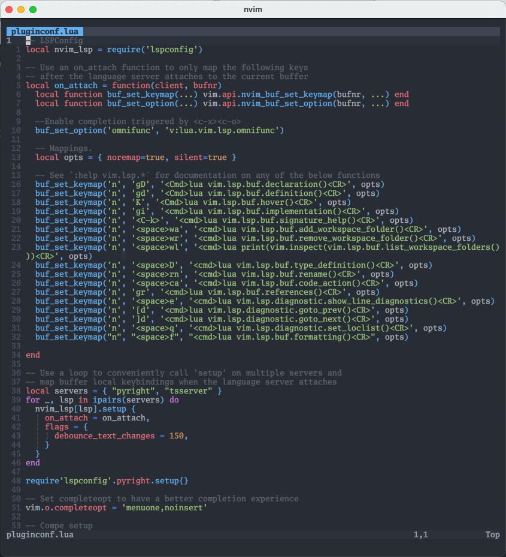

# NeoVim

My personal neovim configuration.

## Screenshot

- Font: Go Mono
- Colorscheme: One Dark
- Terminal: Kitty



## Setup & Installation

We use [packer.nvim](https://github.com/wbthomason/packer.nvim) as package manager. We use lua for configuration.


### Configuration

```sh
lua
├── config.lua
├── maps.lua
├── pluginconf.lua
└── plugins.lua
```

- config.lua - for general neovim settings
- maps.lua - for keybindings
- plugins.lua - contains the list of plugins installed
- pluginconf.lua - contains the config for the plugins installed


### Credits

My plugin is written from scratch porting my old vim config to the current state and is re-written in lua completely. It also
got some config and inspiration from the repos below.

- Greg's Config: http://github.com/wincent/wincent
- TJ's Config: http://github.com/tjdevries/config_manager
