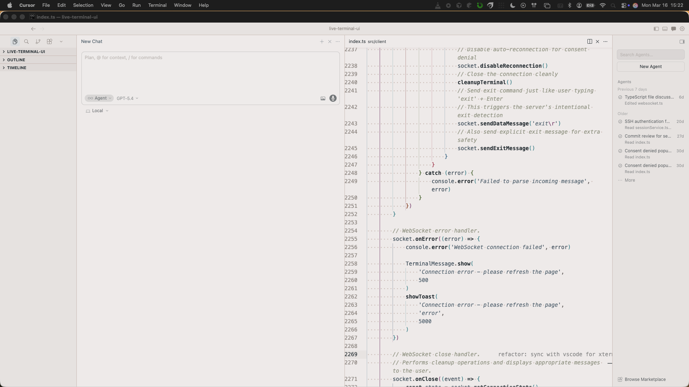

## NeoVim

This config is written as a direct port of my .vimrc in lua.

It contains minimum amount of plugin:
- Fzf for navigation
- Coc for completion and integration with LSP
- Fugitive and Commentary for Git and Commenting

Here is the current setup, running rose-pine theme and using Iosevka font
It is meant to be stable and useful to write code and more code and not be overloaded.
