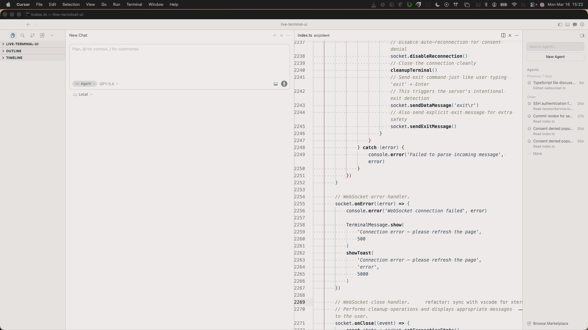

# Neovim Configuration



A minimal, fast, and elegant Neovim configuration with a small `init.lua` entrypoint and focused Lua modules under `lua/config/`.

## Philosophy

This configuration prioritizes stability and productivity over feature bloat. It's designed to write code efficiently without getting in your way.

## Plugin Manager

Uses [lazy.nvim](https://github.com/folke/lazy.nvim) for plugin management with lazy-loading for optimal startup time.

## Layout

The configuration is split into modules under `lua/config/`:

- `globals.lua` - leader keys and provider toggles
- `neovide.lua` - GUI-specific settings
- `lazy.lua` - lazy.nvim bootstrap
- `plugins.lua` - plugin specs and plugin-local config
- `options.lua` - editor options
- `autocmds.lua` - autocmd groups and callbacks
- `keymaps.lua` - keybindings
- `lsp.lua` - built-in LSP setup

## Plugins


| Plugin                                                                          | Purpose                                                 |
| ------------------------------------------------------------------------------- | ------------------------------------------------------- |
| [fff.nvim](https://github.com/vinitkumar/fff.nvim)                              | Blazing fast file finder & buffer switcher (Rust-based) |
| [coc.nvim](https://github.com/neoclide/coc.nvim)                                | Intellisense engine with LSP support                    |
| [vim-commentary](https://github.com/tpope/vim-commentary)                       | Toggle comments with `gc`                               |
| [nvim-rg](https://github.com/duane9/nvim-rg)                                    | Ripgrep integration for searching                       |
| [nvim-tree.lua](https://github.com/nvim-tree/nvim-tree.lua)                     | File explorer sidebar                                   |
| [lualine.nvim](https://github.com/nvim-lualine/lualine.nvim)                    | Beautiful statusline with custom "bubbles" theme        |
| [indent-blankline.nvim](https://github.com/lukas-reineke/indent-blankline.nvim) | Indentation guides                                      |
| [lazygit.nvim](https://github.com/kdheepak/lazygit.nvim)                        | LazyGit integration                                     |
| [tsc.nvim](https://github.com/dmmulroy/tsc.nvim)                                | TypeScript type-checking (configured for `tsgo`)        |


### Colorschemes (Plugin)

- [oscura-vim](https://github.com/vinitkumar/oscura-vim)
- [monokai-pro-vim](https://github.com/vinitkumar/monokai-pro-vim)
- [everforest](https://github.com/sainnhe/everforest)

## Custom Colorschemes

The `colors/` directory contains 40+ hand-picked colorschemes including gruvbox, kanagawa, rose-pine, nord, one, monokai, solarized, and more.

## Key Mappings


| Key                   | Action                     |
| --------------------- | -------------------------- |
| `<C-p>` / `ff`        | Find files                 |
| `<C-b>` / `<leader>b` | Switch buffers             |
| `<C-c>`               | Toggle file tree           |
| `<C-g>`               | Open LazyGit               |
| `<C-t>`               | Next tab                   |
| `<C-e>`               | Show diagnostics           |
| `gc`                  | Toggle comment             |
| `<leader>gd`          | Go to definition           |
| `<leader>gr`          | Find references            |
| `<leader>gi`          | Go to implementation       |
| `<leader>h`           | Horizontal split           |
| `<leader>v`           | Vertical split             |
| `<leader>t`           | New tab                    |
| `<CR>`                | Jump to line (end of file) |
| `<BS>`                | Jump to start of file      |


**Leader key:** `,`

## Features

- **Auto dark/light mode:** Syncs with macOS appearance (sorbet for dark, gruvbox8_soft for light)
- **Smart indentation:** 2-space tabs, auto-indent, smart tabs
- **Relative line numbers:** Enabled by default
- **Trailing whitespace:** Automatically stripped on save
- **Spell checking:** Enabled for markdown, text files, and git commits
- **System clipboard:** Integrated with unnamed and unnamedplus registers
- **LSP support:** Built-in LSP for Sorbet (Ruby) and OCaml, plus CoC for everything else

## Language Support

- TypeScript/JavaScript (CoC + tsc.nvim)
- Python (CoC)
- Go (CoC)
- Ruby (native LSP via Sorbet)
- OCaml (native LSP via ocamllsp)
- HTML/CSS/JSON (CoC)
- And more via CoC extensions

## Requirements

- Neovim 0.9+
- Node.js (for CoC)
- Cargo/Rust (for fff.nvim)
- [LazyGit](https://github.com/jesseduffield/lazygit) (optional, for git integration)
- A [Nerd Font](https://www.nerdfonts.com/) (for icons)

## Installation

```bash
git clone https://github.com/vinitkumar/nvim ~/.config/nvim
nvim  # lazy.nvim will auto-install on first launch
```

## Neovide

This config keeps GUI-specific settings in `lua/config/neovide.lua`.

```bash
brew install --cask neovide
NEOVIDE_FONT="JetBrainsMono Nerd Font:h15" neovide
```

If `NEOVIDE_FONT` is unset, Neovide uses its normal default font. Set `NEOVIDE_FONT` only when you want to force a specific installed font.

## Screenshot

The screenshot shows the setup running with a dark theme and the custom "bubbles" statusline, editing Go code.
