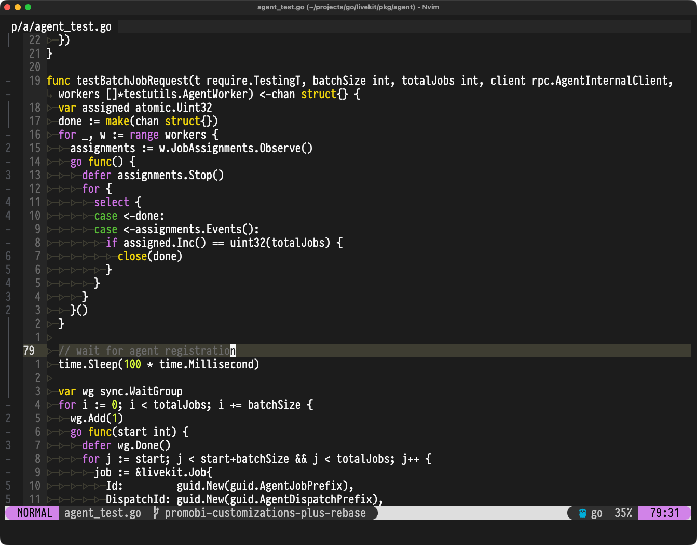

# Neovim Configuration



This repository contains a Lua-based Neovim configuration with a small `init.lua` entrypoint and focused modules under `lua/config/`.

## Entry Point

`init.lua` loads these modules in order:

- `config.globals`
- `config.neovide`
- `config.lazy`
- `config.options`
- `config.autocmds`
- `config.keymaps`
- `config.lsp`

## Layout

- `init.lua` bootstraps the config
- `lua/config/globals.lua` sets leader keys and disables built-in providers/netrw
- `lua/config/neovide.lua` applies GUI-only Neovide settings
- `lua/config/lazy.lua` bootstraps `lazy.nvim`
- `lua/config/options.lua` sets core editor options
- `lua/config/autocmds.lua` defines colorscheme switching and filetype-specific behavior
- `lua/config/keymaps.lua` defines custom mappings
- `lua/config/lsp.lua` enables Neovim's built-in LSP clients for Sorbet and OCaml and turns on 0.12 native LSP features on attach
- `coc-settings.json` stores CoC configuration
- `colors/` contains local colorscheme files

## Plugin Manager

The configuration uses [lazy.nvim](https://github.com/folke/lazy.nvim). If it is not installed, `lua/config/lazy.lua` clones the stable branch into Neovim's data directory on startup.

## Plugins

The current `lua/config/plugins.lua` declares these plugins:

| Plugin | Notes |
| --- | --- |
| [ibhagwan/fzf-lua](https://github.com/ibhagwan/fzf-lua) | Loaded on Linux as the fuzzy finder UI, with `nvim-web-devicons` integration |
| [vinitkumar/fff.nvim](https://github.com/vinitkumar/fff.nvim) | Loaded on non-Linux systems, built with `cargo build --release`, pinned to branch `feat/implement-buffers-support` |
| [dmmulroy/tsc.nvim](https://github.com/dmmulroy/tsc.nvim) | Lazy-loaded for TypeScript buffers, configured to run `tsgo --noEmit --pretty false` |
| [neoclide/coc.nvim](https://github.com/neoclide/coc.nvim) | Built with `npm ci`, loaded on `BufReadPre` |
| [tpope/vim-commentary](https://github.com/tpope/vim-commentary) | Comment operator on `gc` |
| [duane9/nvim-rg](https://github.com/duane9/nvim-rg) | Ripgrep integration |
| [vinitkumar/oscura-vim](https://github.com/vinitkumar/oscura-vim) | Colorscheme |
| [vinitkumar/monokai-pro-vim](https://github.com/vinitkumar/monokai-pro-vim) | Colorscheme |
| [catppuccin/nvim](https://github.com/catppuccin/nvim) | Installed as `catppuccin` |
| [folke/tokyonight.nvim](https://github.com/folke/tokyonight.nvim) | Colorscheme |
| [rebelot/kanagawa.nvim](https://github.com/rebelot/kanagawa.nvim) | Colorscheme |
| [EdenEast/nightfox.nvim](https://github.com/EdenEast/nightfox.nvim) | Colorscheme |
| [rose-pine/neovim](https://github.com/rose-pine/neovim) | Installed as `rose-pine` |
| [sainnhe/gruvbox-material](https://github.com/sainnhe/gruvbox-material) | Colorscheme |
| [nvim-lualine/lualine.nvim](https://github.com/nvim-lualine/lualine.nvim) | Custom "bubbles" statusline theme with native diagnostics/progress segments |
| [nvim-tree/nvim-web-devicons](https://github.com/nvim-tree/nvim-web-devicons) | Dependency for lualine and nvim-tree |
| [sainnhe/everforest](https://github.com/sainnhe/everforest) | Colorscheme |
| [lukas-reineke/indent-blankline.nvim](https://github.com/lukas-reineke/indent-blankline.nvim) | Loaded via `ibl` on `BufReadPost` |
| [nvim-tree/nvim-tree.lua](https://github.com/nvim-tree/nvim-tree.lua) | `:NvimTreeToggle` file tree |
| [kdheepak/lazygit.nvim](https://github.com/kdheepak/lazygit.nvim) | `:LazyGit` integration |
| [sourcegraph/amp.nvim](https://github.com/sourcegraph/amp.nvim) | Always loaded with `auto_start = true` |
| [nvim-treesitter/nvim-treesitter](https://github.com/nvim-treesitter/nvim-treesitter) | Starts Tree-sitter on file buffers and registers `markdown_inline` as `markdown` |
| [brenoprata10/nvim-highlight-colors](https://github.com/brenoprata10/nvim-highlight-colors) | Background color previews, including Tailwind and variable usage |
| [kevinhwang91/nvim-ufo](https://github.com/kevinhwang91/nvim-ufo) | Folding with Tree-sitter/indent providers |
| [kevinhwang91/promise-async](https://github.com/kevinhwang91/promise-async) | `nvim-ufo` dependency |
| [nvim-pack/nvim-spectre](https://github.com/nvim-pack/nvim-spectre) | Search and replace UI |
| [nvim-lua/plenary.nvim](https://github.com/nvim-lua/plenary.nvim) | `spectre` dependency |
| [vimwiki/vimwiki](https://github.com/vimwiki/vimwiki) | Wiki and diary support |
| [ggandor/leap.nvim](https://github.com/ggandor/leap.nvim) | Motion plugin mapped on `s`, `S`, and `gs` |
| [kylechui/nvim-surround](https://github.com/kylechui/nvim-surround) | Surround text objects |
| [j-hui/fidget.nvim](https://github.com/j-hui/fidget.nvim) | LSP progress UI |
| [zenbones-theme/zenbones.nvim](https://github.com/zenbones-theme/zenbones.nvim) | Colorscheme |
| [rktjmp/lush.nvim](https://github.com/rktjmp/lush.nvim) | `zenbones.nvim` dependency |

## Colorschemes

Startup colors are chosen in `lua/config/autocmds.lua`:

- `catppuccin-mocha` when the desired background is `dark`
- `catppuccin-latte` when the desired background is `light`

Background selection works like this:

- `NVIM_BACKGROUND=dark` or `NVIM_BACKGROUND=light` overrides everything
- in Neovide on macOS, the config reads `AppleInterfaceStyle` and follows the system appearance
- outside Neovide, the default is always `dark`

The repo also ships a `colors/` directory with local colorscheme files.

## Options

The current defaults from `lua/config/options.lua` include:

- line numbers and relative line numbers enabled
- UTF-8 encodings
- system clipboard via `unnamed` and `unnamedplus`
- 2-space indentation with `expandtab`
- `textwidth = 80`
- `termguicolors = true`
- Tree-sitter folding via `foldexpr`
- completion popup borders via `pumborder=rounded`
- floating window borders via `winborder=rounded`
- native popup completion tuned with `completeopt = menu,menuone,popup,fuzzy,nearest`
- `pummaxwidth = 80`
- persistent undo in `stdpath("data") .. "/undo//"`
- `cursorline`, `hlsearch`, `wrap`, and `wildmenu` enabled
- `swapfile`, `backup`, and `writebackup` disabled
- `list` enabled by default with visible tab/trailing/extends markers
- `splitbelow` and `splitright` enabled
- `shell = "sh"`

## Autocommands

The config defines these behaviors in `lua/config/autocmds.lua`:

- strip trailing whitespace before write, except for binary buffers and diff files
- re-evaluate background/colorscheme on `FocusGained` and `BufEnter`
- for `~/vimwiki/diary/*.wiki`, insert a template from `~/.vim/bin/generate-vimwiki-diary-template`
- for `*.md`, force `markdown` filetype and set `softtabstop`/`shiftwidth` to 4
- for `*.md`, `*.txt`, and `COMMIT_EDITMSG`, enable wrap, linebreak, spell, and `kspell` completion
- for `.html`, `*.txt`, `*.md`, and `*.adoc`, enable spelling
- for `gitcommit`, enable spelling and set `textwidth = 72`
- for `javascript`, `typescript`, `json`, `c`, `html`, and `htmldjango`, enforce 2-space indentation
- for `*.tsx`, force `filetype=typescript.tsx`
- for `*.yaml` and `*.yml`, force `filetype=yaml`
- for `yaml`, enforce 2-space indentation

## LSP

`lua/config/lsp.lua` enables Neovim's built-in LSP for:

- Sorbet: `srb tc --lsp` with root markers `Gemfile` and `.git`
- OCaml: `$(opam var prefix)/bin/ocamllsp` with root markers `.opam`, `dune-project`, and `.git`

On `LspAttach`, the config also enables these Neovim 0.12 native features when the server supports them:

- auto-triggered native LSP completion
- code lens display and execution
- linked editing ranges
- rounded diagnostic floats

CoC is still installed as a fallback for filetypes that do not have a native LSP client configured here.

## Keymaps

The current custom mappings from `lua/config/keymaps.lua` are:

| Mode | Mapping | Action |
| --- | --- | --- |
| Normal | `<C-p>` | Linux: `require("fzf-lua").files()`, otherwise `require("fff").find_files()` |
| Normal | `<C-b>` | Linux: `require("fzf-lua").buffers()`, otherwise `require("fff").buffers()` |
| Normal | `<C-h>` | Linux: `require("fzf-lua").git_files()`, otherwise `require("fff").git_files()` |
| Normal | `<C-c>` | `:NvimTreeToggle<CR>` |
| Normal | `<C-t>` | `:tabNext<CR>` |
| Normal | `<C-e>` | native diagnostics loclist when a built-in LSP client is attached, otherwise `:CocDiagnostics<CR>` |
| Normal | `<C-s>` | `:GFiles<CR>` |
| Normal | `<C-g>` | `:LazyGit<CR>` |
| Normal | `<leader>gd` | native LSP definition when available, otherwise CoC definition |
| Normal | `<leader>gy` | native LSP type definition when available, otherwise CoC type definition |
| Normal | `<leader>gr` | native LSP references when available, otherwise CoC references |
| Normal | `<leader>gi` | native LSP implementation when available, otherwise CoC implementation |
| Normal | `<leader>h` | horizontal split |
| Normal | `<leader>lr` | `:lsp restart` |
| Normal | `<leader>lw` | native workspace diagnostics |
| Normal | `<leader>z` | `:Goyo<CR>` |
| Normal | `<leader>v` | vertical split |
| Normal | `<leader>t` | new tab |
| Normal | `<leader>dt` | insert `strftime("%c")` |
| Normal | `<CR>` | go to end of file (`G`) |
| Normal | `<BS>` | go to start of file (`gg`) |
| Normal | `<j>` | display-line down (`gj`) |
| Normal | `<k>` | display-line up (`gk`) |
| Normal | `grx` | run native LSP code lens |
| Insert | `<Tab>` | CoC popup next item, otherwise native popup next item, native omni-completion trigger, or literal tab |
| Insert | `<S-Tab>` | CoC popup previous item or native popup previous item |
| Insert | `<CR>` | CoC confirm, otherwise native popup confirm when an item is selected, otherwise newline |
| Normal/Visual | `<D-=>` | increase Neovide scale |
| Normal/Visual | `<D-->` | decrease Neovide scale |
| Normal/Visual | `<D-0>` | reset Neovide scale |

Leader is `,`.

## Neovide

`lua/config/neovide.lua` is only applied when `vim.g.neovide` is set.

Current Neovide settings:

- `guifont` is set only when `NEOVIDE_FONT` is non-empty
- scale factor starts at `1.0`
- padding is `10` on all sides
- refresh rate is `120`
- floating blur is `2.0` on both axes
- floating shadow is enabled
- floating z height is `10`
- light angle is `45`
- light radius is `5`
- cursor animation length is `0.05`
- cursor trail size is `0.8`
- cursor antialiasing is enabled
- quit confirmation is enabled

## Requirements

Based on the current config, these external tools are expected:

- Neovim with Lua config support and `vim.lsp.config` / `vim.lsp.enable`
- `git` to bootstrap `lazy.nvim`
- `fzf` for `fzf-lua` on Linux
- `cargo` to build `fff.nvim` on non-Linux systems
- `npm` to build `coc.nvim`
- `node` to run `coc.nvim`
- `ripgrep` for `nvim-rg`
- `lazygit` for `:LazyGit`
- `srb` for the Sorbet LSP
- `opam` and `ocamllsp` for the OCaml LSP
- `tsgo` for `tsc.nvim`
- `~/.vim/bin/generate-vimwiki-diary-template` if you use vimwiki diary creation

## Installation

```bash
git clone https://github.com/vinitkumar/nvim ~/.config/nvim
nvim
```

On first launch, `lazy.nvim` bootstraps itself and installs the configured plugins.
